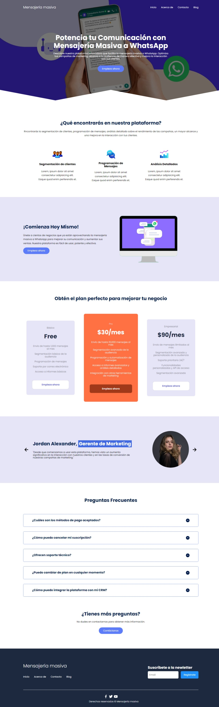

#  Mensajería Masiva a WhatsApp - Landing Page

Este proyecto consiste en una landing page para una plataforma de mensajería masiva a WhatsApp. Proporciona información sobre los servicios ofrecidos, características principales y precios.

## Tecnologías Utilizadas


## Contenido

- [Demo](#demo)
- [Capturas de Pantalla](#captura-de-pantalla)
- [Características](#características)
- [Cómo Usar](#como-usar)

## Demo <a name="demo"></a>

Puedes ver una demostración en vivo de la landing page [aquí](https://nicole-palomino.github.io/landing-page-mensajeria/).

## Captura de Pantalla <a name="captura-de-pantalla"></a>



## Características <a name="características"></a>

- Información detallada sobre la plataforma de mensajería masiva a WhatsApp.
- Sección de preguntas frecuentes (FAQ) para abordar las consultas comunes.
- Testimonios de usuarios reales que han utilizado la plataforma.
- Planes y precios para diferentes niveles de uso.
- Enlace de llamada a la acción para contactar al equipo de soporte.

## Cómo Usar <a name="como-usar"></a>

1. Clona el repositorio: 
```bash
git clone https://github.com/tu-usuario/mensajeria-whatsapp-landing-page.git
```

2. Abre index.html en tu navegador web.
3. Si desea el funcionamiento del newletter, configure el formspree y en action coloque su enlace